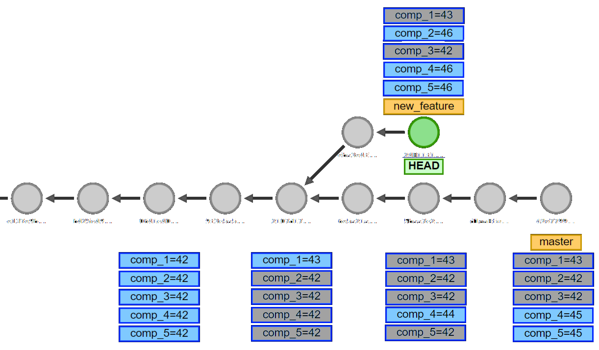

---
author-meta:
  - Wesley Yarde
date-meta: July 1, 2021
pagetitle: Gino Keva in under 5 minutes
url-gh: https://github.com/wyarde
url-gino-keva: https://github.com/philips-software/gino-keva
url-talk: https://wyarde.github.io/talk-gino-keva-in-under-5-minutes
x: '<span style="color:White">**'
xx: "**</span>"
cursor: <span style="color:Moccasin;position:relative;top:8px;margin-left:-19px;font-size:110%">ꕯ</span>
---

## $pagetitle$

\
The Gathering\
$date-meta$\

## \ {data-transition="fade"}

:::: {.r-stack style="font-size:var(--heading2-size);color:gray"}

$x$Gino Keva$xx$

::::

### \ {data-transition="fade"}

:::: {.r-stack style="font-size:var(--heading2-size); color:gray;margin-top:35px"}

[$cursor$$x$Gino Keva$xx$]{.fragment .fade-out data-fragment-index="1" data-autoslide="200"}

[A$cursor$$x$Gino Keva$xx$]{.fragment .fade-in-then-out data-fragment-index="1" data-autoslide="200"}

[A $cursor$$x$Gino Keva$xx$]{.fragment .fade-in-then-out data-fragment-index="2" data-autoslide="200"}

[A $x$G$xx$$cursor$$x$ino Keva$xx$]{.fragment .fade-in-then-out data-fragment-index="3" data-autoslide="200"}

[A $x$Gi$xx$$cursor$$x$no Keva$xx$]{.fragment .fade-in-then-out data-fragment-index="4" data-autoslide="200"}

[A $x$Gi$xx$t$cursor$ $x$no Keva$xx$]{.fragment .fade-in-then-out data-fragment-index="5" data-autoslide="200"}

[A $x$Gi$xx$t $cursor$$x$no Keva$xx$]{.fragment .fade-in-then-out data-fragment-index="6" data-autoslide="200"}

[A $x$Gi$xx$t $x$n$xx$$cursor$$x$o Keva$xx$]{.fragment .fade-in-then-out data-fragment-index="7" data-autoslide="200"}

[A $x$Gi$xx$t $x$no$xx$$cursor$ $x$Keva$xx$]{.fragment .fade-in-then-out data-fragment-index="8" data-autoslide="200"}

[A $x$Gi$xx$t $x$no$xx$t$cursor$ $x$Keva$xx$]{.fragment .fade-in-then-out data-fragment-index="9" data-autoslide="200"}

[A $x$Gi$xx$t $x$no$xx$te$cursor$ $x$Keva$xx$]{.fragment .fade-in-then-out data-fragment-index="10" data-autoslide="200"}

[A $x$Gi$xx$t $x$no$xx$tes$cursor$ $x$Keva$xx$]{.fragment .fade-in-then-out data-fragment-index="11" data-autoslide="200"}

[A $x$Gi$xx$t $x$no$xx$tes $cursor$$x$Keva$xx$]{.fragment .fade-in-then-out data-fragment-index="12" data-autoslide="200"}

[A $x$Gi$xx$t $x$no$xx$tes $x$K$xx$$cursor$$x$eva$xx$]{.fragment .fade-in-then-out data-fragment-index="13" data-autoslide="200"}

[A $x$Gi$xx$t $x$no$xx$tes $x$Ke$xx$$cursor$$x$va$xx$]{.fragment .fade-in-then-out data-fragment-index="14" data-autoslide="200"}

[A $x$Gi$xx$t $x$no$xx$tes $x$Ke$xx$y$cursor$$x$va$xx$]{.fragment .fade-in-then-out data-fragment-index="15" data-autoslide="200"}

[A $x$Gi$xx$t $x$no$xx$tes $x$Ke$xx$y $cursor$$x$va$xx$]{.fragment .fade-in-then-out data-fragment-index="16" data-autoslide="200"}

[A $x$Gi$xx$t $x$no$xx$tes $x$Ke$xx$y $x$v$xx$$cursor$$x$a$xx$]{.fragment .fade-in-then-out data-fragment-index="17" data-autoslide="200"}

[A $x$Gi$xx$t $x$no$xx$tes $x$Ke$xx$y $x$va$xx$$cursor$]{.fragment .fade-in-then-out data-fragment-index="18" data-autoslide="200"}

[A $x$Gi$xx$t $x$no$xx$tes $x$Ke$xx$y $x$va$xx$l$cursor$]{.fragment .fade-in-then-out data-fragment-index="19" data-autoslide="200"}

[A $x$Gi$xx$t $x$no$xx$tes $x$Ke$xx$y $x$va$xx$lu$cursor$]{.fragment .fade-in-then-out data-fragment-index="20" data-autoslide="200"}

[A $x$Gi$xx$t $x$no$xx$tes $x$Ke$xx$y $x$va$xx$lue$cursor$]{.fragment .fade-in-then-out data-fragment-index="21" data-autoslide="200"}

[A $x$Gi$xx$t $x$no$xx$tes $x$Ke$xx$y $x$va$xx$lue $cursor$]{.fragment .fade-in-then-out data-fragment-index="22" data-autoslide="200"}

[A $x$Gi$xx$t $x$no$xx$tes $x$Ke$xx$y $x$va$xx$lue s$cursor$]{.fragment .fade-in-then-out data-fragment-index="23" data-autoslide="200"}

[A $x$Gi$xx$t $x$no$xx$tes $x$Ke$xx$y $x$va$xx$lue st$cursor$]{.fragment .fade-in-then-out data-fragment-index="24" data-autoslide="200"}

[A $x$Gi$xx$t $x$no$xx$tes $x$Ke$xx$y $x$va$xx$lue sto$cursor$]{.fragment .fade-in-then-out data-fragment-index="25" data-autoslide="200"}

[A $x$Gi$xx$t $x$no$xx$tes $x$Ke$xx$y $x$va$xx$lue stor$cursor$]{.fragment .fade-in-then-out data-fragment-index="26" data-autoslide="200"}

[A $x$Gi$xx$t $x$no$xx$tes $x$Ke$xx$y $x$va$xx$lue store$cursor$]{.fragment .fade-in-then-out data-fragment-index="27" data-autoslide="200"}

::::

### \ {data-transition="fade"}

:::: {.r-stack style="font-size:var(--heading2-size); color:gray;margin-top:35px"}

A $x$Gi$xx$t $x$no$xx$tes $x$Ke$xx$y $x$va$xx$lue store

::::

## Git Notes

<sub><sup>_Supplement a commit message without changing the commit itself_</sup></sub>

- <span style="color:Moccasin">`git notes add|remove|show|list`</span>
- Stored as commits in refs/notes/

## Gino Keva

<sub><sup>_A Git notes key value store_</sup></sub>

- <span style="color:Moccasin">`gino-keva set|unset|get|list`</span>
- Gino Keva operates on the current commit
- If no note is available, nearest one is copied over

### Example syntax

```console
$$ gino-keva set foo bar
$$ gino-keva get foo
bar
```

:::{.element: class="fragment" data-fragment-index="1"}

```console
$$ gino-keva set counter 12 && gino-keva list
COUNTER=12
FOO=bar
```

:::

:::{.element: class="fragment" data-fragment-index="2"}

```console
$$ git commit --allow-empty -m empty
$$ gino-keva set counter 13 && gino-keva list
COUNTER=13
FOO=bar
```

:::

## A build pipeline


### Gino Keva through history



# End

|                    Gino Keva                    |               This talk               |
| :---------------------------------------------: | :-----------------------------------: |
| []($url-gino-keva$) | []($url-talk$) |
